# mulle-container

#### 🛄 Arrays, hashtables and a queue

A collection of C (C11) data structures to store integers, strings, pointers,
structs.

All data structures can live (temporarily) on the stack, or permanently in the
heap. None of them are thread-safe.
[mulle-allocator](//github.com/mulle-c/mulle-allocator) is used pervasively to
simplify memory management.
Some data structures utilize callbacks that are compatible to OS X's
[`NSHashtable`](//nshipster.com/nshashtable-and-nsmaptable/) and friends.


| Release Version                                       | Release Notes  | AI Documentation
|-------------------------------------------------------|----------------|---------------
|  [](//github.com/mulle-c/mulle-container/actions)  | [RELEASENOTES](RELEASENOTES.md) | [DeepWiki for mulle-container](https://deepwiki.com/mulle-c/mulle-container)


## Documentation & Guides

* **[Getting Started & Patterns](asset/dox/index.md)** — curated intro, container selection, usage examples
* [Design Decisions](dox/DESIGN.md) — why things are this way
* [Container Callbacks](dox/API_CONTAINER_CALLBACK.md)
* [Arrays](dox/API_ARRAY.md)
* [Maps](dox/API_MAP.md)
* [Sets](dox/API_SET.md)
* [Pointer Arrays](dox/API_POINTERARRAY.md)
* [Pointer Queue](dox/API_POINTERQUEUE.md)
* [Range Set](dox/API_RANGESET.md)
* [Range Map](dox/API_RANGEMAP.md)
* [Associative Arrays](dox/API_ASSOC.md)
* [Struct Arrays](dox/API_STRUCTARRAY.md)
* [Pointer Pair Arrays](dox/API_POINTERPAIRARRAY.md)
* [Pointer Sets](dox/API_POINTERSET.md)
* [Hash Functions](dox/API_HASH.md)

## Data Structures

The names of the functions are consistent. Each function is a **verb**
that is prefixed with the name of the data structure it handles. So for example
the `get` function for `mulle_array` is `mulle_array_get`. The first parameter,
- except for creation functions - is always the container itself.

Check out [SYNTAX.md](//github.com/mulle-c/mulle-c11/dox/SYNTAX.md) for a
somewhat formal explanation and [VERBS.md](dox/VERBS.md) for a list of common
verbs being employed.

The various underscore prefixed functions may `assert` their parameters, but
when compiled for "Release" there will be no runtime checks. The non
underscore functions protect themselves against NULL pointers.
For development it is wise, to use a debug version of the library.


### Performance relative to plain C

Absolute ns/op numbers are meaningless without a reference, so this
project's benchmarks ([`test/bench/`](test/bench/README.md)) measure
mulle-container containers **against plain-C baselines** on the same
machine, same data, same hash function. The "Performance" notes in the
individual sections below quote measured ratios against these baselines:

| Baseline              | What it is                                       | Compared to          |
|-----------------------|--------------------------------------------------|----------------------|
| raw C array           | `void *[]`, unchecked index, `realloc` growth    | pointer/struct arrays|
| khash-style hashtable | classic open addressing, linear probing, 75 % load | map, set          |

A ratio of 1.0 means a mulle-container container costs exactly what the
equivalent hand-rolled C code costs. Above 1.0 is the price you pay for
NULL-safety, allocator indirection and generic callbacks; below 1.0
means the container's tuning (growth policy, load factor) beats the
naive baseline. Measured on a release build with
[`head-to-head-bench`](test/bench/README.md); ballpark figures, not
microbenchmark-grade measurements. (Sorted-structure lookups like
`mulle_assoc` are compared against C `qsort` + `bsearch` in the crossover
benchmark instead.)


### Arrays

All arrays store their elements in a single block of memory.

#### Standard Arrays

##### `mulle_array` conveniently stores managed pointers

This is an array of `void *` that `realloc`s on power of two sizes. The
elements equality is determined with a callback function. The elements
can be copied/freed or reference counted using
[`mulle_container_callback`s](dox/API_CONTAINER_CALLBACK.md). It could be the
basis for a `NSMutableArray` implementation (but isn't currently).

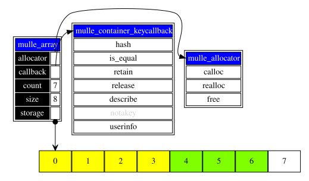

> The array was allocated with an initial capacity of 4. The addition of a
> fifth value forced an expansion to 8 (yellow: initial cells in use,
> green: additional cells in use).
> The "notakey" is not used for arrays.

There is also an [API Documentation](dox/API_ARRAY.md).

> **Performance**: compared to a raw C array, `add` costs about the same
> (~1.0x) and `get` is a single load. The NULL-safe getter is `static
> inline`, so when the container is init'd and used in the same function
> the compiler inlines it and folds the NULL guard away - it becomes
> literally `array->_storage[ i]`, identical to an unchecked raw array
> index. The `member` lookup is a linear scan, so for membership tests of
> larger collections use a set instead (see [Sets](#sets)).


##### `mulle__array` conveniently stores managed pointers with minimal overhead

This is `mulle_array` minus the `allocator` and `callback`.

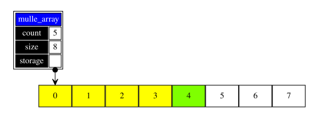


##### `mulle_pointerarray` stores unmanaged pointers

This is a stripped down version of `mulle_array` to manage
untyped `void *`. The pointers are simply compared with `==`. You can also
store integers casted as `void *`. The memory referenced by a pointer isn't
managed (e.g. freed when removed from storage), like mulle-array does.

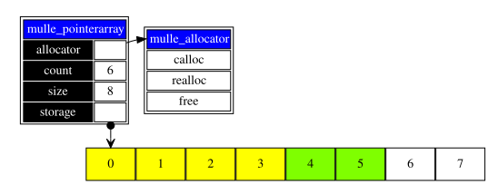

> **Performance**: the closest thing to a raw C array this library offers.
> `add` is within noise of a `realloc`-based raw array (~1.0x) and the
> double-underscore `get` is literally `array->_storage[ i]` with no check
> at all - identical to an unchecked index. No callbacks, no allocation
> per element.


##### `mulle__pointerarray` stores pointers with minimal overhead

This is a stripped down version of `mulle_pointerarray` minus the `allocator`.
It can be convenient for quickly building up lots of C arrays of `void *`.

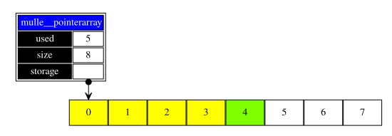


#### Special Arrays

##### `mulle__rangeset` stores selected elements of an array

This is an array of `mulle_range` elements, that are always kept in sorted
order. A `mulle_range` is defined as

``` c
struct mulle_range
{
   uintptr_t   location;
   uintptr_t   length;
};
```

which is identical to `NSRange`. Ranges are combined and split as necessary, so
that `mulle_rangeset` can ensure that

* there are no overlapping ranges (they are coalesced)
* there are no adjacent ranges (they are coalesced)
* there are no ranges of size 0 (they are removed)

It could be the basis for an `NSIndexSet`.

> **Performance**: insert is a binary search for the insertion point,
> plus a `memmove` of the trailing ranges when inserting in the middle
> (appending at the end measured ~70 ns at n=100000 in release, i.e.
> bsearch plus a null shift). Overlapping ranges coalesce, so the
> structure stays compact.


#### `mulle_structarray` stores any kind of C type with proper alignment

This is a variant of `mulle_pointerarray`, but instead of using `void *` you
can specify any C type as the element size. This can be useful for building
arrays of `float` or any kind of `struct` for example.

> **Performance**: same cost model as `mulle_pointerarray` (contiguous
> storage, no callbacks), but elements are copied in by value, so `add`
> costs one `memcpy` of `sizeof(element)` on top.


#### Associative Arrays

##### `mulle_pointerpairarray` stores unmanaged key/value pairs

This is a modified `mulle_pointerarray` that holds key/value pairs of
`void *`, `void *` instead of just a single `void *`. In comparison to using a
map, order of addition is preserved and the space requirement is lower. But
it is slow in searches.

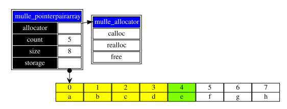

> **Performance**: like a C array of two-pointer pairs - append is as
> cheap as array `add`, but lookup is O(n) (or O(log n) after the explicit
> `qsort`). Use it for small, ordered collections; use a map for large,
> unordered ones.

##### `mulle__pointerpairarray` stores key/value pairs with minimal overhead

This is the `mulle_pointerpairarray` variant without the `allocator`.

### Queues

#### `mulle__pointerqueue` stores unmanaged pointers without copying

This is a FIFO queue for `void *`. It does not `realloc` on addition. Instead
it chains buckets of `void *` together. This makes large quantities of
additions pretty much as fast as possible.

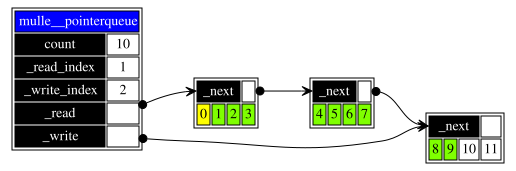

> **Performance**: `add` and `pop` are pointer moves into preallocated
> buckets - measured at the same cost as raw array operations (single
> digit ns), with no `realloc` ever, so cost stays flat regardless of
> size. The tradeoff is one small allocation per bucket (16 or 64 slots).

> Filled cells indicate a cell containing a pointer value. Unlike hashtables,
> there is no sentinel/hole concept — buckets are densely packed. (NULL is
> still not a valid value to store; it is used as the return value of `pop`
> to signal "queue empty".)
> The cells are clustered in buckets and the buckets form a linked list. The
> `_read_index` maintains the number of values already read from the current
> `_read` bucket.
> Correspondingly the `_write_index` keeps a record of the next available index
> in  the `_write` bucket. If a bucket is exhausted a new one is allocated,
> chained into the linked list and the `_write` pointer is set to it, resetting
> the `_write_index`.

It is the basis for the `NSAutoreleasePool` implementation.


#### `mulle__structqueue` stores structs instead of pointers

A key difference to `mulle_structarray` is, that maintaining pointers to
`mulle__structqueue` elements are possible, whereas `mulle_structarray`
elements may get reorganised.

> **Performance**: same bucket-chained cost model as `mulle__pointerqueue`,
> plus one `memcpy` of `sizeof(element)` per `add`/`pop`. Stable element
> addresses come at no lookup cost.


### Hashtables

A hashtable is about twice the size of the number of elements contained within,
the rest being holes. A hash of the element is used to quickly locate the entry
in the hashtable.

Hashtable `realloc` and redistribute their elements on power of two size
boundaries.

A hashtables use "holes" to discriminate between valid entries and available
space. Consequently a hashtable can not use all possible `void *` values as
keys and needs a special **notakey** marker for such holes.

The "notakey" value is usually `mulle_not_a_pointer`, which is defined as
`(void *) INTPTR_MIN`.


#### Maps

Hashtable data structures that provide associative storage (key/value) are
called maps.

##### `mulle_map` conveniently stores managed keys and values

The elements equality is determined with a callback function and the elements
can be copied/freed or reference counted using callbacks organized in a
[`mulle_container_callback`](dox/API_CONTAINER_CALLBACK.md).

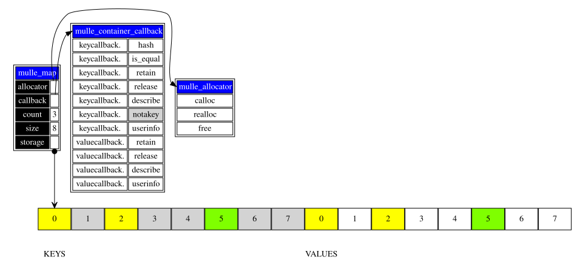

> **Performance**: compared to a hand-rolled khash-style open-addressing
> table with the same hash function, `set` measured ~0.85-1.2x and `get`
> ~1.2x across runs (the range reflects measurement noise). With the
> intptr/pointer callbacks the generic callback layer costs little; the
> NULL-safety and the callback indirection are the main extras.

> The contigous memory is split into two equal sized parts "KEYS" and "VALUES".
> Gray cells indicate a "hole", they contain **notakey**. The corresponding
> value is undefined (white).
> The map was allocated with an initial capacity of 4. The addition of a third
> value forced an expansion to 8, as the hashtable needs enough holes to
> operate. (yellow: initial cells in use, green: additional cells in use).
> On growth all the keys and values are redistributed.
> The cells are placed according to the hash of the key. On collision the next
> available hole is used.


##### `mulle__map` stores managed keys and values with minimal overhead

This is `mulle_map` minus the `allocator` and the `callback`. It is the basis
for the `NSMutableDictionary` implementation. Performance is the same as
`mulle_map` with intptr/pointer callbacks.

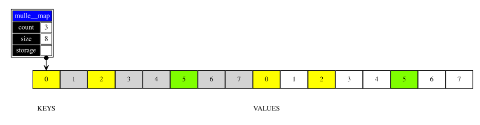


##### `mulle__pointermap` stores unmanaged keys and values

This is a simplified version of `mulle__map`. Equality is determined by
comparing pointers with `==` and holes are always filled with
`mulle_not_a_pointer` (which is `INTPTR_MIN`). Therefore no callbacks are used
by `mulle__pointermap`.

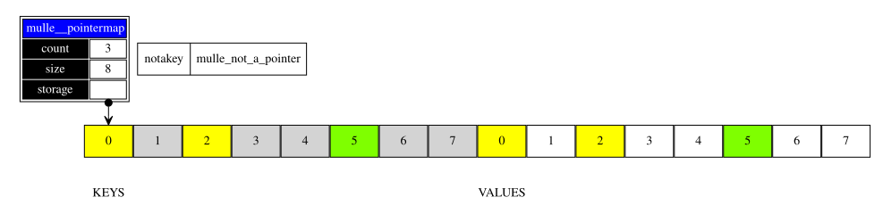

### Sets

A set is the most simple hashtable. It's like a map minus the value part.
The storage of pointers and objects in a set is not very memory efficient,
compared to an array, but searching is fast for sets with larger item
quantities. (ca. > 100)

#### `mulle_set` conveniently stores managed pointers for quick lookup

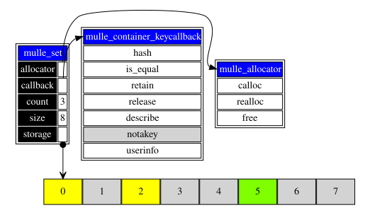

> **Performance**: the best ratio of the whole family. `set` (insert)
> measured ~0.6-1.2x of a khash-style table and `member` ~1.0-1.3x
> (ranges include noise). The crossover benchmark shows the set beating
> a linear array scan from n=10 on, and it stays flat (~9-19 ns) up to
> n=100000 while the array scan grows linearly to tens of microseconds.

#### `mulle__set` stores managed pointers with minimal overhead

The `mulle__set` is a `mulle_set` without the `allocator` and the `callback`.

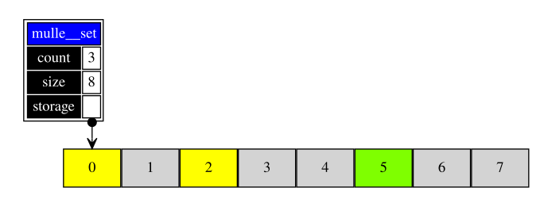

> **Performance**: same as `mulle_set` with pointer/intptr callbacks.


##### `mulle__pointerset` stores unmanaged pointers with minimal overhead

This is a simplified version of `mulle__set`. Equality is determined by
comparing pointers with `==` and holes are always filled with
`mulle_not_a_pointer` (which is `INTPTR_MIN`). Therefore no callbacks are used
by `mulle__pointerset`.

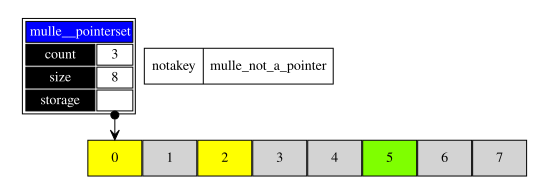

> **Performance**: the fastest membership test in the library - no hash
> function call at all (pointer identity hashing), just an index
> computation. Use it when `==` equality on raw pointers is all you need.


## Predefined Callbacks

### Key Callbacks

As used by `mulle_array`, `mulle_map`, `mulle_set`. Each callback name is to
be prefixed with `mulle_container_keycallback_`, which has been elided for
brevity:

| Name                        | Type       | Notakey      | Equality | Copies | Frees
|-----------------------------|------------|--------------|----------|--------|-------
| `_int`                      | `int`      | `INTPTR_MIN` | `==`     | NO     | NO
| `_intptr`                   | `intptr_t` | `INTPTR_MIN` | `==`     | NO     | NO
| `_nonowned_pointer_or_null` | `void *`   | `INTPTR_MIN` | `==`     | NO     | NO
| `_nonowned_pointer`         | `void *`   | `NULL`       | `==`     | NO     | NO
| `_owned_pointer`            | `void *`   | `NULL`       | `==`     | NO     | YES
| `_copied_cstring`           | `char *`   | `NULL`       | `strcmp` | YES    | YES
| `_nonowned_cstring`         | `char *`   | `NULL`       | `strcmp` | NO     | NO
| `_owned_cstring`            | `char *`   | `NULL`       | `strcmp` | NO     | YES

### Value Callbacks

As used by `mulle_map`. Value callbacks don't need to hash and check for
equality. Each callback name is to be prefixed with
`mulle_container_valuecallback`, which has been elided for brevity.


| Name                | Type       | Copies | Frees
|---------------------|------------|--------|-------
| `_int`              | `int`      | NO     | NO
| `_intptr`           | `intptr_t` | NO     | NO
| `_nonowned_pointer` | `void *`   | NO     | NO
| `_owned_pointer`    | `void *`   | NO     | YES
| `_copied_cstring`   | `char *`   | YES    | YES
| `_nonowned_cstring` | `char *`   | NO     | NO
| `_owned_cstring`    | `char *`   | NO     | YES


## Efficiency

As time critical sections are inlined, the performance of the
library code is as good as your compiler (within the runtime limitations of the
algorithm).

Here is an example of mulle-container code, compiled with -Os:

``` c
int   _mulle__pointerset_count_zeroes_generic( struct mulle__pointerset *src,
                                               struct mulle_container_keycallback *callback,
                                               struct mulle_allocator *allocator)
{
   struct mulle__genericpointersetenumerator  rover;
   void                                       *item;
   int                                        rval;

   rval  = 0;
   rover = _mulle__pointerset_enumerate_generic( src, callback);
   while( _mulle__genericpointersetenumerator_next( &rover, &item))
   {
       if( item == 0)
           ++rval;
   }
   mulle__genericpointersetenumerator_done( &rover);
   return( rval);
}
```

produces:

``` nasm
_mulle__pointerset_count_zeroes_generic(mulle__pointerset*, mulle_container_keycallback*, mulle_allocator*): # @_mulle__pointerset_count_zeroes_generic(mulle__pointerset*, mulle_container_keycallback*, mulle_allocator*)
        mov     rcx, qword ptr [rdi + 8]
        test    rcx, rcx
        je      .LBB0_1
        mov     rdx, qword ptr [rsi + 40]
        mov     rsi, qword ptr [rdi]
        xor     eax, eax
.LBB0_3:                                # =>This Inner Loop Header: Depth=1
        mov     rdi, qword ptr [rsi]
        add     rsi, 8
        cmp     rdi, rdx
        je      .LBB0_3
        cmp     rdi, 1
        adc     eax, 0
        dec     rcx
        jne     .LBB0_3
        ret
.LBB0_1:
        xor     eax, eax
        ret
```


### You are here

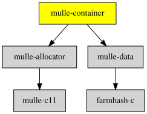


## Add

mulle-container is a component of the [mulle-core](//github.com/mulle-core/mulle-core) library. So in your code include the mulle-core umbrella header:

``` c
#include <mulle-core/mulle-core.h>
```

### Add mulle-core to a cmake and git project

``` bash
git submodule add https://github.com/mulle-core/mulle-core.git mulle-core
```

Add this to your `CMakeLists.txt`:

``` cmake
add_subdirectory( mulle-core)
target_link_libraries( ${PROJECT_NAME} PRIVATE mulle-core)
```


### Add mulle-core to a mulle-sde project

``` sh
mulle-sde add github:mulle-core/mulle-core
```

### Embed mulle-container with clib

``` sh
clib install --out src mulle-c/mulle-container
```

Append `src` to your include path (e.g. add `-isystem src`  to your `CFLAGS`)
and compile all the sources that were downloaded.


## Author

[Nat!](https://mulle-kybernetik.com/weblog) for Mulle kybernetiK  


