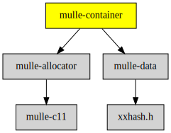

# mulle-container

#### 🛄 Arrays, hashtables and a queue

A collection of C (C11) data structures to store integers, strings, pointers,
structs.

All data structures can live (temporarily) on the stack, or permanently in the
heap. None of them are thread-safe.
[mulle-allocator](//github.com/mulle-c/mulle-allocator) is used pervasively to
simplify memory management.
Some data structures utilize callbacks that are compatible to OS X's
[`NSHashtable`](//nshipster.com/nshashtable-and-nsmaptable/) and friends.

| Release Version
|-----------------------------------
| [](//github.com/mulle-c/mulle-container/tree/release) [](//github.com/mulle-c/mulle-container/actions)


## Aspects

### Algorithms

There are three basic algorithms employed by the data structures in
mulle-container. The hashtable, the array and the queue.

Both the array and the hashtable use a contiguous block of memory.
An array reallocates on growth. A hashtable copies on growth. The queue is a
linked list of smaller memory blocks.


### Contents and "notakey"

The hashtables use "holes" to discriminate between valid entries and available
space. Consequently a hashtable can not use all possible `void *` values as
keys and needs a special **notakey** marker for such holes.

The "notakey" value is usually `mulle_not_a_pointer`, which is defined as
`(void *) INTPTR_MIN`.


### Embedded allocator

For many data structures there exist two variants. One that keeps a reference
to the memory allocator, and one that doesn't. The data structure without an
allocator, is obviously a bit smaller than the one with.
If you are managing millions of hashtables, as may be the case when doing
database fetches, this can be significant. On the other hand, embedding the
allocator makes the API simpler and less susceptible to allocator mix ups.
You also get "convenient enumeration" (see below)

### Uniform and convenient enumeration

Looping over the data structure contents is done with enumerators. The
enumerator holds the state of the loop. The enumeration loop over any
data structure, if unform. You setup an enumerator with `_enumerate`,
use the enumerator with `_next` and end the loop with `_done`. It looks like
this:

``` c
struct mulle_arrayenumerator  rover;
char                          *item;

rover = mulle_array_enumerate( &array);
while( _mulle_arrayenumerator_next( &rover, &item))
{
   printf( "%s\n", item);
}
mulle_arrayenumerator_done( &rover);
```

With a convenience macro, the enumerator setup is hidden and the code
simplifies to:

``` c
char   *item;

mulle_array_for( &array, item)
{
   printf( "%s\n", item);
}
```

### NULL leniency

Each data structure supplies rigid functions and lenient functions, with
respect to NULL parameters. The rigid functions are prefixed with '`_`' and
do not check for NULL pointers. The lenient functions do nothing, if NULL is
passed. This is like Objective-C where you can call methods with 'nil'.

> #### Caveat
>
> A NULL map will have always return NULL in an enumeration for the (failed)
> key value.
>

### Pointers or Objects

A data structure may merely handle pointer equality as a way of comparing
members. These data structures conventionally contain the word "pointer" in
their name. They are very efficient and sometimes all you need. Other data
structures use a number of callbacks, to test for equality and to handle memory
management and to create hash codes.


## Example

Here is an example using `mulle_map` to associate c-strings with each other.
All the necessary memory management (copying of keys and values) is performed
by `mulle_map` using the callbacks contained in a
`mulle_container_keyvaluecallback` struct. The on-stack version is commented
out:


``` c
#include <mulle-container/mulle-container.h>

static struct mulle_container_keyvaluecallback   callback;

static void  test( void)
{
//   struct mulle_map              auto_map;
   struct mulle_map   *map;
   char               *key;
   char               *value;

//   mulle_map_init( &auto_map, 0, &callback, NULL);
//   map = &auto_map;
   map = mulle_map_create( 0, &callback, NULL);

   mulle_map( map, "VfL", "VFL");
   mulle_map( map, "Bochum", "BOCHUM");
   mulle_map( map, "1848", "1848");

   if( ! mulle_map_get( map, "1849"))
   {
      mulle_map_for( map, key, value)
      {
         printf( "%s : %s\n", key, value);
      }
   }
   mulle_map_remove( map, "1848");

//   mulle_map_done( map);
   mulle_map_destroy( map);
}


int   main( void)
{
   // use predefined structs to compose our custom callback
   callback.keycallback   = mulle_container_keycallback_copied_cstring;
   callback.valuecallback = mulle_container_valuecallback_copied_cstring;

   test();
   return( 0);
}
```

## flexarray, a replacement for alloca

The `mulle_flexarray` can be used as an replacement for `alloca`. The problem
with `alloca` is always two-fold. 1.) It's non-standard and not available on
all platforms. 2.) The amount of memory to alloca may exceed the available
stack space. The `mulle_flexarryy` solves this problem by using a small amount
of stack space for low memory scenario and moving to `malloc`, when it's
needed.

Example:

``` c
 void  foo( int n, int *data)
{
   mulle_flexarray_define( copy, int, 32, n);

   memcpy( copy, data, n * sizeof( int));    // using copy here for something

   mulle_flexarray_done( copy);
}
```

A mulle_flexarray named "copy" is created, this is either a pointer to stack
space or to a malloc area. `mulle_flexarray_define` defines the basic type
of the array (`int`) and the maximum amount to be stored in a stack array is
`32`.


## Data Structures

The names of the functions are consistent. Each function is a **verb**
that is prefixed with the name of the data structure it handles. So for example
the `get` function for `mulle_array` is `mulle_array_get`. The first parameter,
- except for creation functions - is always the container itself.

Check out [SYNTAX.md](//github.come/mulle-c/mulle-c11/dox/SYNTAX.md) for a somewhat
formal explanation and [VERBS.md](dox/VERBS.md) for a list of common verbs
being employed.

The various functions `assert` their parameters, but when compiled for release
there are no runtime checks. For development it is wise to use a debug version
of the library.

### Arrays

All arrays store their elements in a single block of memory.

#### Standard Arrays

##### `mulle_array`

This is an array of `void *` that `realloc`s on power of two sizes. The
elements equality is determined with a callback function and the elements
can be copied/freed or reference counted using
[`mulle_container_callback`s](dox/API_CONTAINER_CALLBACK.md). Deletions use
`memmove`. It could be the basis for a `NSMutableArray` implementation
(but isn't currently).


> The array was allocated with an initial capacity of 4. The addition of a
> fifth value forced an expansion to 8 (yellow: initial cells in use,
> green: additional cells in use).
> The "notakey" is not used for arrays.

There is also an [API Documentation](dox/API_ARRAY.md).


##### `mulle__array`

This is `mulle_array` minus the `allocator` and `callback`.


##### `mulle_pointerarray`

This is a stripped down version of `mulle_array` to manage
untyped `void *`. The pointers are simply compared with `==`. You can also
store integers casted as `void *`.


##### `mulle__pointerarray`

This is a stripped down version of `mulle_pointerarray` minus the `allocator`.
It can be convenient for quickly building up C arrays of `void *`.


#### Special Arrays

##### `mulle__uniquepointerarray`

`mulle__uniquepointerarray` is based on `mulle__pointerarray`. It keeps its
elements of `void *` in an array in sorted order for searching by pointer
equality. The sorting is done lazily. It's use is as a set. It's
advantage over a hashtable set are low memory requirement and superior
performance for smaller quantities.


##### `mulle__rangeset`

This is an array of `mulle_range` elements, that are always kept in sorted
order. A `mulle_range` is defined as

``` c
struct mulle_range
{
   uintptr_t   location;
   uintptr_t   length;
};
```

which is identical to `NSRange`. Ranges are combined and split as necessary, so
that `mulle_rangeset` can ensure that

* there are no overlapping ranges (they are coalesced)
* there are no adjacent ranges (they are coalesced)
* there are no ranges of size 0 (they are removed)

It could be the basis for an `NSIndexSet`.


#### `mulle_structarray`

This is a variant of `mulle_pointerarray`, but instead of using `void *` you
can specify any C type as the element size. This can be useful for building
arrays of `float` or any kind of `struct` for example.


#### Associative Arrays

##### `mulle_pointerpairarray`

This is modified `mulle_pointerarray` that holds key/value pairs of
`void *`, `void *` instead of just a single `void *`. In comparison to using a
map, order of addition is preserved and the space requirement is lower. But
it is slow in searches.


##### `mulle__pointerpairarray`

This is the `mulle_pointerpairarray` variant without the `allocator`.

### Queues

#### `mulle__pointerqueue`

This is a FIFO queue for `void *`. It does not `realloc` on addition. Instead
it chains buckets of `void *` together. This makes large quantities of
additions pretty much as fast as possible.


> Filled cells indicate a cell containing a pointer value. All values are
> possible, so there are no holes.
> The cells are clustered in buckets and the buckets form a linked list. The
> `_read_index` maintains the number of values already read from the current
> `_read` bucket.
> Correspondingly the `_write_index` keeps a record of the next available index
> in  the `_write` bucket. If a bucket is exhausted a new one is allocated,
> chained into the linked list and the `_write` pointer is set to it, resetting
> the `_write_index`.


It is the basis for the `NSAutoreleasePool` implementation.


### Hashtables

A hashtable is
about twice the size of the number of elements contained within, the rest being
holes. A hash of the element is used to quickly
locate the entry in the hashtable.

Hashtable `realloc` and redistribute their
elements on power of two size boundaries.

#### Maps

Hashtable data structures that provide associative storage (key/value) are
called maps.

##### `mulle_map`

The elements equality is determined with a callback function and the elements
can be copied/freed or reference counted using callbacks organized in a
[`mulle_container_callback`](dox/API_CONTAINER_CALLBACK.md).


> The contigous memory is split into two equal sized parts "KEYS" and "VALUES".
> Gray cells indicate a "hole", they contain **notakey**. The corresponding
> value is undefined (white).
> The map was allocated with an initial capacity of 4. The addition of a third
> value forced an expansion to 8, as the hashtable needs enough holes to
> operate. (yellow: initial cells in use, green: additional cells in use).
> On growth all the keys and values are redistributed.
> The cells are placed according to the hash of the key. On collision the next
> available hole is used.


##### `mulle__map`

This is `mulle_map` minus the `allocator` and the `callback`. It is the basis
for the `NSMutableDictionary` implementation.


##### `mulle__pointermap`

This is a simplified version of `mulle__map`. Equality is determined by
comparing pointers with `==` and holes are always filled with
`mulle_not_a_pointer` (which is `INTPTR_MIN`). Therefore no callbacks are used
by `mulle__pointermap`.


### Sets

A set is a map minus the value part. The storage of pointers and objects in a
set is not very efficient, compared to an array, but searching is fast for
larger item quantities.

#### `mulle_set`


#### `mulle__set`

The `mulle__set` is a `mulle_set` without the `allocator` and the `callback`.


##### `mulle__pointerset`

This is a simplified version of `mulle__set`. Equality is determined by
comparing pointers with `==` and holes are always filled with
`mulle_not_a_pointer` (which is `INTPTR_MIN`). Therefore no callbacks are used
by `mulle__pointerset`.


## Predefined Callbacks

### Key Callbacks

As used by `mulle_array`, `mulle_map`, `mulle_set`. Each callback name is to
be prefixed with `mulle_container_keycallback_`, which has been elided for
brevity:

Name                        | Type       | Notakey      | Equality | Copies | Frees
----------------------------|------------|--------------|----------|--------|-------
`_int`                      | `int`      | `INTPTR_MIN` | `==`     | NO     | NO
`_intptr`                   | `intptr_t` | `INTPTR_MIN` | `==`     | NO     | NO
`_nonowned_pointer_or_null` | `void *`   | `INTPTR_MIN` | `==`     | NO     | NO
`_nonowned_pointer`         | `void *`   | `NULL`       | `==`     | NO     | NO
`_owned_pointer`            | `void *`   | `NULL`       | `==`     | NO     | YES
`_copied_cstring`           | `char *`   | `NULL`       | `strcmp` | YES    | YES
`_nonowned_cstring`         | `char *`   | `NULL`       | `strcmp` | NO     | NO
`_owned_cstring`            | `char *`   | `NULL`       | `strcmp` | NO     | YES

### Value Callbacks

As used by `mulle_map`. Value callbacks don't need to hash and check for
equality. Each callback name is to be prefixed with
`mulle_container_valuecallback`, which has been elided for brevity.


Name                | Type       | Copies | Frees
--------------------|------------|--------|-------
`_int`              | `int`      | NO     | NO
`_intptr`           | `intptr_t` | NO     | NO
`_nonowned_pointer` | `void *`   | NO     | NO
`_owned_pointer`    | `void *`   | NO     | YES
`_copied_cstring`   | `char *`   | YES    | YES
`_nonowned_cstring` | `char *`   | NO     | NO
`_owned_cstring`    | `char *`   | NO     | YES


## Efficiency

As time critical sections are all inlined, the performance of the
library code is as good as your compiler (within the runtime limitations of the
algorithm.

Here is an example of mulle-container code, compiled with -Os:

``` c
int   _mulle__pointerset_count_zeroes_generic( struct mulle__pointerset *src,
                                               struct mulle_container_keycallback *callback,
                                               struct mulle_allocator *allocator)
{
   struct mulle__genericpointersetenumerator  rover;
   void                                       *item;
   int                                        rval;

   rval  = 0;
   rover = _mulle__pointerset_enumerate_generic( src, callback);
   while( _mulle__genericpointersetenumerator_next( &rover, &item))
   {
       if( item == 0)
           ++rval;
   }
   mulle__genericpointersetenumerator_done( &rover);
   return( rval);
}
```

produces:

``` nasm
_mulle__pointerset_count_zeroes_generic(mulle__pointerset*, mulle_container_keycallback*, mulle_allocator*): # @_mulle__pointerset_count_zeroes_generic(mulle__pointerset*, mulle_container_keycallback*, mulle_allocator*)
        mov     rcx, qword ptr [rdi + 8]
        test    rcx, rcx
        je      .LBB0_1
        mov     rdx, qword ptr [rsi + 40]
        mov     rsi, qword ptr [rdi]
        xor     eax, eax
.LBB0_3:                                # =>This Inner Loop Header: Depth=1
        mov     rdi, qword ptr [rsi]
        add     rsi, 8
        cmp     rdi, rdx
        je      .LBB0_3
        cmp     rdi, 1
        adc     eax, 0
        dec     rcx
        jne     .LBB0_3
        ret
.LBB0_1:
        xor     eax, eax
        ret
```


### You are here




## Add

### Either: link library

Use [mulle-sde](//github.com/mulle-sde) to add mulle-container to your project:

``` sh
mulle-sde dependency add --c --github mulle-c mulle-container
```

### Or: add Sources

Alternatively you can read [STEAL.md](//github.com/mulle-c11/dox/STEAL.md) on
how to add mulle-c source code into your own projects.


## Install

### mulle-sde

Use [mulle-sde](//github.com/mulle-sde) to build and install mulle-container and all dependencies:

```
mulle-sde install --prefix /usr/local \
   https://github.com/mulle-c/mulle-container/archive/latest.tar.gz
```

### Manual Installation


Install the requirements:

Requirements                                             | Description
---------------------------------------------------------|-----------------------
[mulle-allocator](//github.com/mulle-c/mulle-allocator)  | Memory allocation wrapper
[mulle-data](//github.com/mulle-c/mulle-data)            | Hash code

Install into `/usr/local`:

``` sh
cmake -B build \
      -DCMAKE_INSTALL_PREFIX=/usr/local \
      -DCMAKE_PREFIX_PATH=/usr/local \
      -DCMAKE_BUILD_TYPE=Release &&
cmake --build build --config Release &&
cmake --install build --config Release
```


## Platforms and Compilers

All platforms and compilers supported by
[mulle-c11](//github.com/mulle-c/mulle-c11).


## Author

[Nat!](//www.mulle-kybernetik.com/weblog) for
[Mulle kybernetiK](//www.mulle-kybernetik.com) and
[Codeon GmbH](//www.codeon.de)
