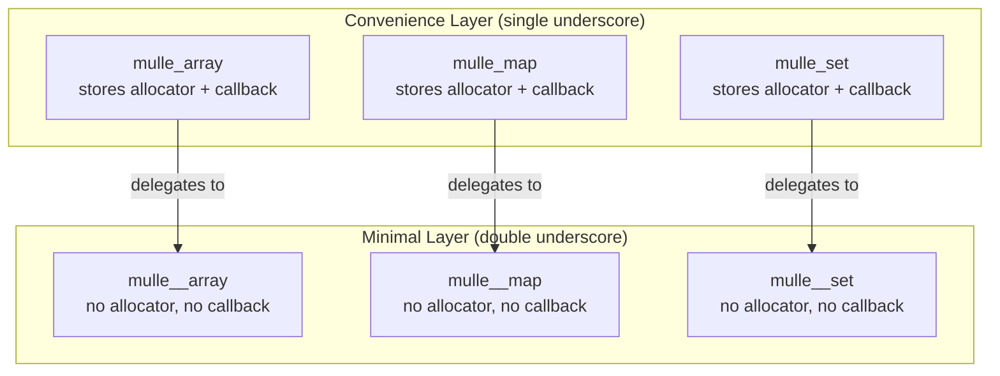
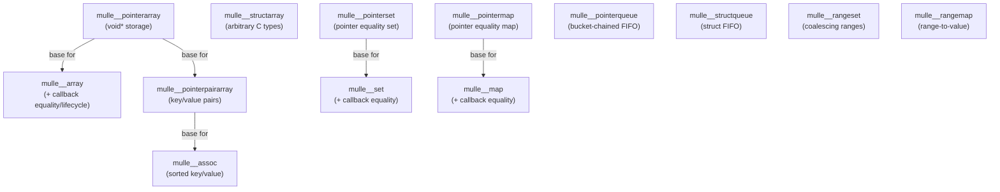
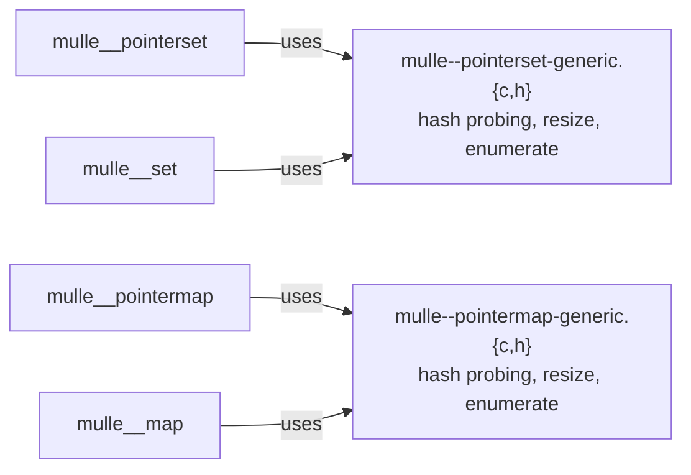

# mulle-container Architecture

## Design Philosophy

mulle-container is a C11 library of data structures optimized for performance,
memory efficiency, and composability. Every design decision serves these goals:

1. **Inlined hot paths** — Time-critical operations are `static inline` in headers
2. **Pluggable allocators** — All memory goes through `mulle_allocator`, never raw `malloc`
3. **Callback-driven behavior** — Element lifecycle (hash, equality, copy, free) is configurable
4. **Stack-friendly** — All containers support stack allocation via `_init`/`_done`
5. **No thread safety** — Callers handle synchronization; no internal locks

## Two-Tier Layering Pattern

Every data structure follows a consistent two-tier design:

- `mulle_foo` (single underscore) — Convenience wrapper. Bundles `allocator` and
  `callback` into the struct. Caller-friendly: pass fewer arguments per call.
- `mulle__foo` (double underscore) — Minimal/raw version. No stored allocator or
  callback. Lower memory overhead. Caller must pass allocator/callback to every
  function call.

The convenience layer functions are thin inlines that extract the stored
allocator/callback and forward to the minimal layer.

## Composition Hierarchy

Key relationships:
- `mulle__array` is built on top of `mulle__pointerarray`, adding callback-driven lifecycle
- `mulle__assoc` is built on `mulle__pointerpairarray`, adding sorted binary search
- `mulle__set` wraps `mulle__pointerset` with callback support
- `mulle__map` wraps `mulle__pointermap` with callback support
- Queues and range structures are independent

## Generic Implementation Pattern

Hashtable-based structures (sets and maps) share generic implementation files:

The `*-generic` files contain the core open-addressing hash table logic
(linear probing, power-of-two sizing, sentinel-based hole detection). The
concrete types parameterize this logic via callbacks or direct pointer
comparison.

## Memory Layout Principles

- **Arrays**: Single contiguous `void **` buffer, power-of-two realloc growth
- **Hashtables**: Single contiguous buffer split into keys region and (for maps)
  values region. ~50% fill factor. Holes marked with `mulle_not_a_pointer`
  (`(void *) INTPTR_MIN`)
- **Queues**: Linked list of fixed-size buckets. No realloc on add — O(1) enqueue
- **Range sets**: Sorted array of `mulle_range` structs, auto-coalescing

## Function Safety Tiers

| Prefix | NULL-safe | Asserts in Debug | Example |
|--------|-----------|------------------|---------|
| `mulle_foo_verb` | Yes | Yes | `mulle_array_add()` |
| `_mulle_foo_verb` | No (asserts) | Yes | `_mulle_array_add()` |
| `_mulle__foo_verb` | No (asserts) | Yes | `_mulle__array_add()` |

The non-prefixed functions protect against NULL container pointers. The
underscore-prefixed functions skip NULL checks but may assert in debug builds.
In release builds, underscore functions have zero overhead.
